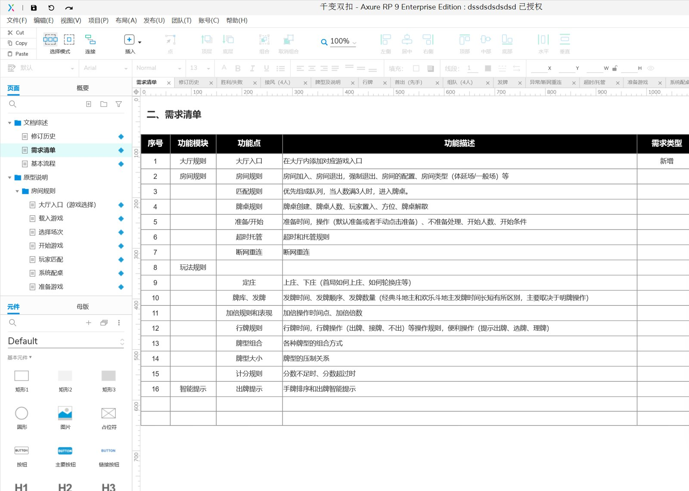
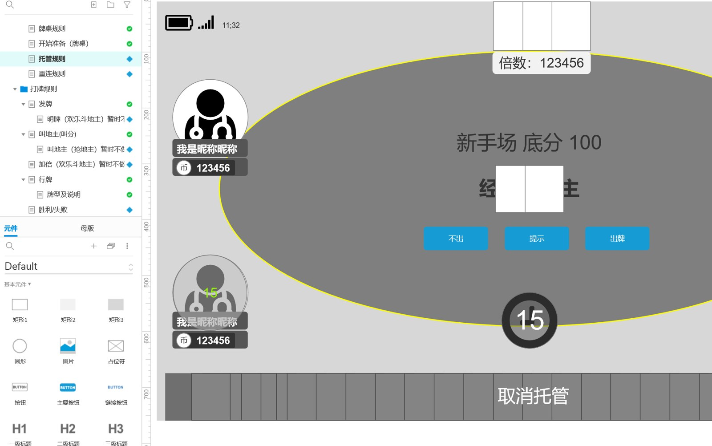
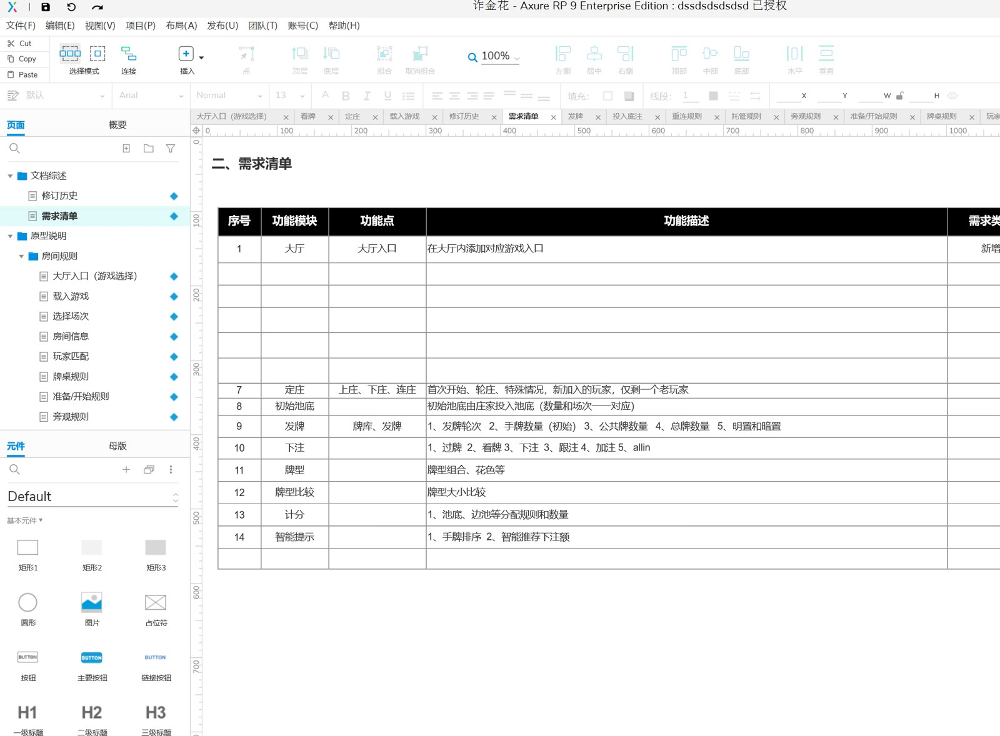

# 棋牌游戏策划文案｜规则、数值与界面原型

[简体中文](README.zh-CN.md) · [繁體中文](README.zh-TW.md) · [English](README.en.md) · [产品页面](https://niubideren111.github.io/Chess-and-Card-Game-Product-Design-Copy/zh-cn/)

围绕斗地主、麻将、梭哈、扎金花、牛牛、捕鱼、双扣等玩法，整理游戏规则、数值表和界面原型的设计资料。适合产品策划、交互设计和开发团队在立项与需求评审阶段参考。

**棋牌游戏策划文案 · 棋牌游戏设计文档 · 麻将策划文案 · 斗地主游戏原型**

## 项目重点

### 游戏规则

按玩法拆分回合流程、操作条件和结算规则，便于形成开发需求。

### 数值与表格

以设计表格展示配置字段、奖励和消耗等策划内容。

### 界面原型

通过操作界面与布局截图，辅助策划、UI 和程序协作。

## 资料阅读与核对方式

1. **先确认产品形态**：依次查看截图和图注，确认产品类型与可见功能流程。
2. **再核对文件证据**：直接打开下方列出的源码或文档，不只依赖功能描述。
3. **检查可构建范围**：确认准备运行的部分是否具备依赖、资源、配置和启动脚本。
4. **确认授权**：阅读仓库许可；商业素材及完整工程交付应另行取得书面授权。

## 产品截图







## 公开源码与资料

| 文件 | 说明 |
|---|---|
| [README.md](README.md) | 产品范围、游戏类型与文档预览 |

## 开始阅读

```bash
git clone https://github.com/niubideren111/Chess-and-Card-Game-Product-Design-Copy.git
cd Chess-and-Card-Game-Product-Design-Copy
```

## 常见问题

### 这是游戏源码还是策划文案？

本项目聚焦策划文案与原型展示；客户端和服务器源码另见对应游戏项目。

### 适合哪些团队？

适合需要编写规则、梳理功能流程和制作界面原型的产品、设计与开发团队。

## 后续资料完善方向

优先上传一份经过授权的规则 PDF、一个数值表示例和一份界面流程说明，并在 README 中链接实际文件。 后续更新还应加入版本化依赖清单、经过验证的构建或导入步骤、简明架构/产品流程图，以及能对应真实文件变化的版本记录。大型授权资源可放入 GitHub Releases 并提供校验值，不能提交密钥、生产地址或用户数据。

目前该仓库更适合作为产品展示资料。技术评估时，应进一步取得文件清单、支持平台和版本、数据库结构、部署记录及可复现演示，再判断是否构成完整源码交付。

## 相关项目

- [Fishing-Game-Art-Assets](https://github.com/niubideren111/Fishing-Game-Art-Assets)
- [Texas-Hold-em-source-code](https://github.com/niubideren111/Texas-Hold-em-source-code)

## 资料范围与许可

当前公开仓库提供产品说明及设计文案截图；完整文档的交付范围通过项目联系方式沟通。 公开内容以实际文件、依赖和许可为准，不承诺搜索排名、直接上线或固定性能结果。

- Telegram: [@fox_lovemyself](https://t.me/fox_lovemyself)
- GitHub: [Chess-and-Card-Game-Product-Design-Copy](https://github.com/niubideren111/Chess-and-Card-Game-Product-Design-Copy)
